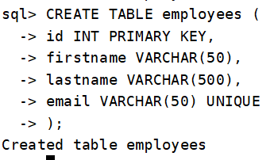
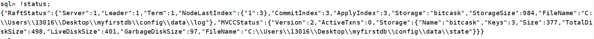
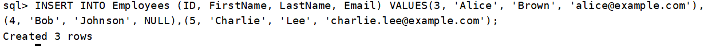
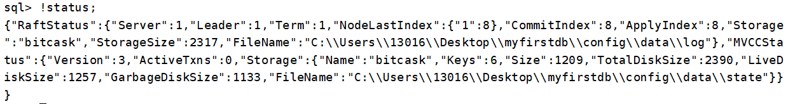
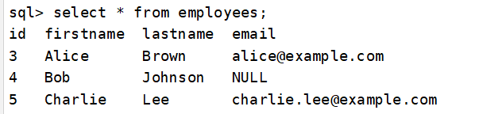
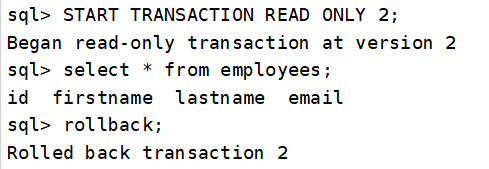
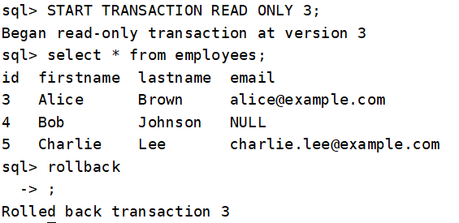

# 事务

#### 1. 事务类型分类

本系统支持两种基础事务类型，并根据操作特性进行扩展：

**1.1 只读事务 (Read-Only Transaction)**

- 特性：仅执行数据查询操作
- 版本控制：提交(commit)/回滚(rollback)操作不会触发数据库版本号递增
- 扩展类型：
  - 基于版本号的只读事务：
    - 通过指定版本号访问历史数据快照
    - 支持跨多版本数据一致性读取

**1.2 读写事务 (Read-Write Transaction)**

- 特性：包含数据修改操作(DML)
- 版本控制：成功提交时将递增数据库版本号
- ACID保障：
  - 原子性(Atomicity)
  - 一致性(Consistency)
  - 隔离性(Isolation)
  - 持久性(Durability)

#### 2. 事务控制模式

**2.1 显式事务 (Explicit Transaction)**

- 控制方式：需手动声明事务边界

- 管理命令：

```sql
BEGIN;                            -- 开启只读事务
COMMIT;                           -- 提交变更
ROLLBACK;                         -- 回滚操作
START TRANSACTION READ ONLY;      -- 开启只读事务
START TRANSACTION READ WRITE;     -- 开启读写事务
START TRANSACTION READ ONLY 3;    -- 开启基于版本的只读事务
```

**2.2 隐式事务 (Implicit Transaction)**

- 控制方式：由系统自动管理

- 运行特征：

  - 单条SQL语句自动构成独立事务
  - 执行成功自动提交
  - 异常时自动回滚
  - 无版本号变更（仅限只读操作）

#### 3. 版本控制机制

- 版本号生成规则：
  - 读写事务成功提交时+1
  - 只读事务不改变当前版本号
- 快照隔离实现：
  - 基于MVCC多版本并发控制
  - 读操作获取事务开始时的版本快照
  - 写操作创建新数据版本

#### 4.案例

- 创建表：

  ```sql
  CREATE TABLE employees (
  		id INT PRIMARY KEY,
  		firstname VARCHAR(50),
  		lastname VARCHAR(500),
  		email VARCHAR(50) UNIQUE
  	);
  ```

  

- 查看当前版本状态

  ```go
  !status;
  ```

  

  可知当前版本为2

- 插入数据

  ```sql
  INSERT INTO Employees (ID, FirstName, LastName, Email) VALUES(3, 'Alice', 'Brown', 'alice@example.com'), (4, 'Bob', 'Johnson', NULL),	(5, 'Charlie', 'Lee', 'charlie.lee@example.com');
  ```

​	

- 查看当前版本状态

  ```go
  !status;
  ```

  版本已更新为Version:3

- 查询数据

  

- 指定版本查询数据

  

- 查看最新数据


