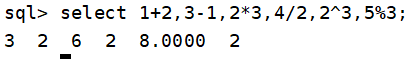
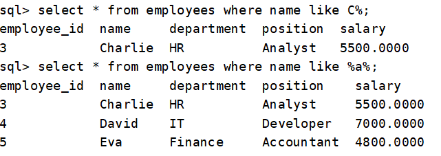
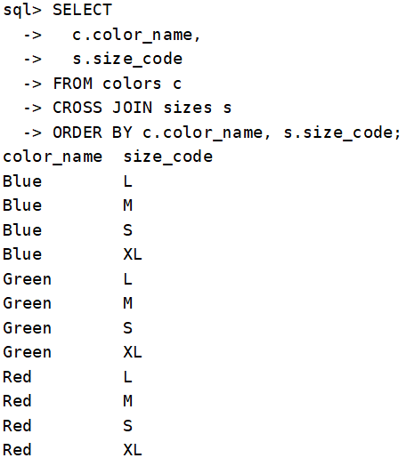

## 1.可解析的数据类型

- CHAR

- VARCHAR

- TEXT

- BOOLEAN

- BOOL

- FLOAT

- Double

- Int

- Integer

## 2.可解析的常量

- TRUE

- FLASE
- NULL

```sql
CREATE TABLE example_table (
    id INT PRIMARY KEY,
    char_col CHAR(10),         
    varchar_col VARCHAR(255),   
    text_col TEXT,              
    boolean_col BOOLEAN,        
    bool_col BOOL,              
    float_col FLOAT,            
    double_col DOUBLE,          
    int_col INT,                
    integer_col INTEGER,        
    nullable_col VARCHAR(100)   
);

INSERT INTO example_table (
    id, char_col, varchar_col, text_col,
    boolean_col, bool_col, float_col,
    double_col, int_col, integer_col, nullable_col
) VALUES (
    1,
    'ABC',                     
    'ABC',         
    'ABC',    
    TRUE,                      
    FALSE,                     
    3.14,                      
    2.71828,                   
    42,                        
    100,                       
    NULL                       
);
```


## 3.可解析的列定义

- NOT NULL
- NULL
- PRIMARY KEY
- UNIQUE
- DEFAULE

```sql
CREATE TABLE example_table2 (
    id INT PRIMARY KEY NOT NULL,
    username VARCHAR(100) UNIQUE NOT NULL,    
    email VARCHAR(100) UNIQUE NULL DEFAULT NULL,
    is_active BOOLEAN NOT NULL DEFAULT TRUE
);
INSERT INTO example_table2 (id,username) 
VALUES (1,'A');
```


## 4.可解析的列约束

- PRIMARY KEY
- UNIQUE KEY
- KEY
- FOREIGN KEY

```sql
CREATE TABLE departments (
	  department_id INT NOT NULL,
	  department_name VARCHAR(50) NOT NULL,
	  PRIMARY KEY (department_id),
	  UNIQUE KEY (department_name)
	);

INSERT INTO departments (department_id,department_name)
	VALUES
	   (1,'Human Resources'),
	   (2,'Engineering');
	   
CREATE TABLE employees (
    employee_id INT NOT NULL,
    salary INT NOT NULL,
    name VARCHAR(50) NOT NULL,
    email VARCHAR(100) NOT NULL,
    ext_id INT,

    PRIMARY KEY (employee_id),
    UNIQUE KEY (email),
    KEY salary (salary),
    FOREIGN KEY (name)
       REFERENCES departments(department_name)
);

INSERT INTO employees (employee_id,salary, name,email,ext_id)
	VALUES
	   (1,100, 'Human Resources', '123@.com', 11),
	   (2,200, 'Engineering', '456@.com', 22);
```


## 5.可解析的函数

- SUM
- MIN
- MAX
- AVG
- COUNT

```sql
CREATE TABLE sales (
    id INT PRIMARY KEY,
    product_name VARCHAR(50),
    price DOUBLE,
    quantity INT
);

INSERT INTO sales (id,product_name, price, quantity) VALUES
(1,'Laptop', 999.99, 3),
(2,'Phone', 699.50, 5),
(3,'Tablet', 299.00, 2),
(4,'Headphones', 149.99, 8),
(5,'Speaker', 199.95, 4);

```


## 6.可解析的表达式

- \+

- \-

- \*

- /

- ^

- %

  

- = 

- \>

- \>= / <>

  

- <

- \<=

- != / <>

  

- and / &&

  

- or / ||

  

- 嵌套and、or

  

## 7.可解析关键词

- ORDER BY

- GROUP BY

- DESC ASC

```sql
CREATE TABLE employees (
	 employee_id INT PRIMARY KEY,
	 name VARCHAR(50),
	 department VARCHAR(50),
	 position VARCHAR(50),
	 salary FLOAT
	);
	
INSERT INTO employees (employee_id, name, department, position, salary)
	VALUES
	 (1, 'Alice', 'HR', 'Manager', 5000.00),
	 (2, 'Bob', 'IT', 'Developer', 6000.00),
	 (3, 'Charlie', 'HR', 'Analyst', 5500.00),
	 (4, 'David', 'IT', 'Developer', 7000.00),
	 (5, 'Eva', 'Finance', 'Accountant', 4800.00);
```


- HAVING

  

- LIMIT

- OFFSET

  
  
- LIKE

  

## 8.可解析的join 类型

- LEFT JOIN

  ```sql
  CREATE TABLE users (
    id INT PRIMARY KEY,
    username VARCHAR(50),
    email VARCHAR(50)
  );
  
  CREATE TABLE orders (
    order_id INT PRIMARY KEY,
    user_id INT,
    product VARCHAR(50),
    amount FLOAT
  );
  
  INSERT INTO users (id, username, email) VALUES
  (1, 'John Doe', 'john@example.com'),
  (2, 'Jane Smith', 'jane@example.com'),
  (3, 'Bob Johnson', 'bob@example.com'),
  (4, 'Alice Brown', 'alice@example.com'); 
  
  INSERT INTO orders (order_id, user_id, product, amount) VALUES
  (101, 1, 'Laptop', 999.99),
  (102, 1, 'Mouse', 19.99),
  (103, 2, 'Keyboard', 49.99),
  (104, 1, 'Monitor', 199.99),
  (105, 999, 'Headphones', 89.99),  
  (106, NULL, 'USB Cable', 9.99);  
  ```

  

- Right join


- CROSS JOIN

```sql
CREATE TABLE colors (
  color_id INT PRIMARY KEY,
  color_name VARCHAR(20)
);

CREATE TABLE sizes (
  size_id INT PRIMARY KEY,
  size_code VARCHAR(10)
);

INSERT INTO colors (color_id, color_name) VALUES
(1, 'Red'),
(2, 'Blue'),
(3, 'Green');

INSERT INTO sizes (size_id, size_code) VALUES
(101, 'S'),
(102, 'M'),
(103, 'L'),
(104, 'XL');
```



- inner join(join)


## 9.删改

- UPDATE


- DELETE


- DROP TABLE


## 10.执行计划

建表语句见4


